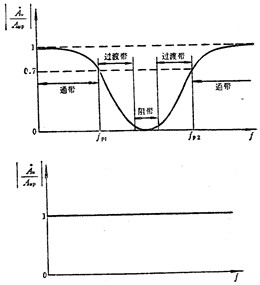
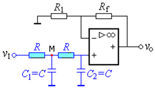
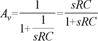
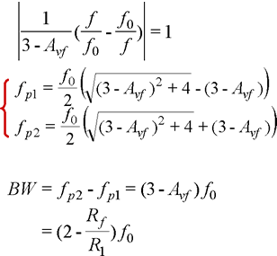
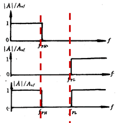
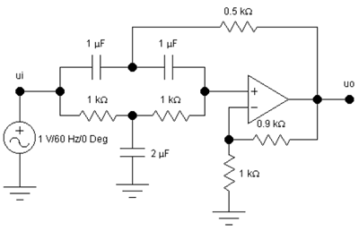
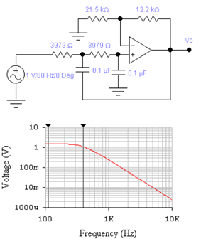

# 电路入门-电路分析基础

#### 介绍
配套视频：https://www.bilibili.com/video/BV1rx411q7Fn
配套课件：这里
有史上最全的运放典型应用电路及分析和运算放大器应用

> **运算放大器应用**

# §8.1 比例运算电路

8.1.1 反相比例电路

1\. 基本电路

> 电压并联负反馈输入端虚短、虚断
>
>  {width="1.770832239720035in" height="0.8333333333333334in"}

特点：

反相端为虚地，所以共模输入可视为 0，对运放共模抑制比要求低 输出电阻小，带负载能力强 要求放大倍数较大时，反馈电阻阻值高，稳定性差。 如果要求放大倍数 100，R1=100K，Rf=10M

2\. T 型反馈网络

> 虚短、虚断

8.1.2 同相比例电路

1\. 基本电路：电压串联负反馈

> 输入端虚短、虚断

特点： 输入电阻高，输出电阻小，带负载能力强

V-=V+=Vi，所以共模输入等于输入信号，对运放的共模 抑制比要求高 2. 电压跟随器

> {width="0.7802099737532808in" height="0.3125in"} {width="2.3430555555555554in" height="1.25in"}

输入电阻大输出电阻小，能真实地将输入信号传给负载而从信号源取流很小

# §8.2 加减运算电路

8.2.1 求和电路

1\. 反相求和电路 虚短、虚断

> {width="2.5206430446194226in" height="1.9791666666666667in"} {width="2.551272965879265in" height="2.1875in"}

特点：调节某一路信号的输入电阻不影响其他路输入与输出的比例关系 2. 同相求和电路

虚短、虚断

> {width="4.187307524059492in" height="3.28125in"}

8.2.2 单运放和差电路

> {width="4.875in" height="3.125in"}

8.2.3 双运放和差电路

> {width="4.75in" height="3.1666666666666665in"}

例 1:设计一加减运算电路 设计一加减运算电路，使 Vo=2Vi1+5Vi2-10Vi3

解：用双运放实现

> {width="4.166666666666667in" height="1.5833333333333333in"}

如果选 Rf1=Rf2=100K，且 R4= 100K 则：R1=50K R2=20K R5=10K

平衡电阻 R3= R1// R2// Rf1=12.5K R6=R4//R5//Rf2= 8.3K 例 2:如图电路，求 Avf，Ri

解：

> {width="4.7927569991251096in" height="3.0520833333333335in"}

# §8.3 积分电路和微分电路

8.3.1 积分电路 电容两端电压与电流的关系：

> {width="4.666666666666667in" height="3.25in"}

积分实验电路

> {width="3.9583333333333335in" height="3.0416666666666665in"}

积分电路的用途

将方波变为三角波（Vi：方波，频率 500Hz，幅度 1V）

> {width="3.832386264216973in" height="2.8125in"}

将三角波变为正弦波（Vi：三角波，频率 500Hz，幅度 1V）

> {width="3.750942694663167in" height="2.7604166666666665in"}

（Vi：正弦波，频率 500Hz，幅度 1V）

> {width="3.5833333333333335in" height="2.625in"}

思考：输入信号与输出信号间的相位关系？

（Vi：正弦波，频率 200Hz，幅度 1V）

> {width="3.875in" height="2.8333333333333335in"}

思考： 输入信号频率对输出信号幅度的影响？

积分电路的其它用途： 去除高频干扰 将方波变为三角波 移相

在模数转换中将电压量变为时间量

# §8.3 积分电路和微分电路

8.3.2 微分电路

> {width="4.690033902012249in" height="2.84375in"}

微分实验电路

> {width="4.008701881014873in" height="2.7291666666666665in"}

把三角波变为方波

（Vi：三角波，频率 1KHz，幅度 0.2V）

> {width="3.7083333333333335in" height="2.7083333333333335in"}

输入正弦波

（Vi：正弦波，频率 1KHz，幅度 0.2V）

> {width="3.3333333333333335in" height="2.4479166666666665in"}

思考：输入信号与输出信号间的相位关系？

（Vi：正弦波，频率 500Hz，幅度 1V）

> {width="3.540721784776903in" height="2.6041666666666665in"}

思考：输入信号频率对输出信号幅度的影响？

# §8.4 对数和指数运算电路

8.4.1 对数电路

> {width="4.688194444444444in" height="3.2083333333333335in"}

对数电路改进

基本对数电路缺点：

运算精度受温度影响大；

小信号时 exp(VD/VT)与 1 差不多大，所以误差很大；

二极管在电流较大时伏安特性与 PN 结伏安特性差别较大，所以运算只在较小的电流范 围内误差较小。

改进电路 1：用三极管代替二极管

> {width="4.593055555555556in" height="3.1666666666666665in"}

电路在理想情况下可完全消除温度的影响

> {width="4.948611111111111in" height="3.75in"}

改进电路 3：实用对数电路

如果忽略 T2 基极电流， 则 M 点电位：

> {width="4.948611111111111in" height="2.96875in"}
>
> {width="2.78125in" height="0.75in"}

8.4.2 指数电路

1\. 基本指数电路

> {width="4.687036307961505in" height="2.8125in"}

2\. 反函数型指数电路 电路必须是负反馈才能正常工作，所以：

> {width="5.0in" height="3.0416666666666665in"}

# §8.5 乘除运算电路

8.5.1 基本乘除运算电路

1\. 乘法电路

> {width="3.7473698600174976in" height="1.9791666666666667in"}
>
> {width="4.708333333333333in" height="3.3333333333333335in"}

乘法器符号

同相乘法器 反向乘法器

2\. 除法电路

> {width="4.625in" height="3.25in"}

8.5.2. 乘法器应用

1\. 平方运算和正弦波倍频

> {width="2.5019619422572177in" height="0.8854166666666666in"}

如果输入信号是正弦波：

> {width="3.5833333333333335in" height="0.53125in"}

只要在电路输出端加一隔直电容，便可得到倍频输出信号。

2\. 除法运算电路

注意：只有在 VX2\>0 时电路才是负反馈

> 

3\. 开方运算电路

> {width="4.690277777777778in" height="2.34375in"}

输入电压必须小于 0，否则电路将变为正反馈。

两种可使输入信号大于 0 的方案：

> {width="3.6479265091863518in" height="3.59375in"}

3\. 调制（调幅）

> {width="3.4902777777777776in" height="1.9270833333333333in"}

4\. 压控增益 乘法器的一个输入端接直流电压（控制信号），另一个接输入信号，则输出信号与输入

信号之比（电压增益）成正比。 V0=KVXvY

> {width="2.031248906386702in" height="1.5in"}

电流-电压变换器 由图可知

> {width="0.9711384514435696in" height="0.21875in"}

可见输出电压与输入电流成比例。 输出端的负载电流：

电流-电压变换电路

若Ｒl 固定，则输出电流与输入电流成比例，此时该电路也可视为电流放大电路。

电压-电流变换器

> {width="4.166666666666667in" height="1.5in"}
>
> 负载不接地 负载接地

由负载不接地电路图可知：

所以输出电流与输入电压成比例。

对负载接地电路图电路，R1 和 R2 构成电流并联负反馈；R3、R4 和 RL 构成构成电压串联 正反馈。

> {width="2.7067071303587054in" height="1.15625in"} {width="2.1675863954505687in" height="1.6354166666666667in"}
>
> {width="4.003211942257217in" height="0.8541666666666666in"}
>
> {width="2.811629483814523in" height="0.8645833333333334in"}

讨论：

1. 当分母为零时， iO →∞，电路自激。

> 2\. 当 R2 /R1 =R3 /R4 时, 则：

说明 iO 与 VS 成正比 , 实现了线性变换。

电压-电流和电流-电压变换器广泛应用于放大电路和传感器的连接处，是很有用的电子 电路。

# §8.6 有源滤波电路

8.6.1 滤波电路基础知识

一. 无源滤波电路和有源滤波电路

> 无源滤波电路: 由*无源元件 ( R , C , L )* 组成
>
> {width="3.4767705599300087in" height="0.78125in"}

有源滤波电路: 用工作在线性区的集成运放和 RC 网络组称，实际上是一种具有特定频 率响应的放大器。有源滤波电路的优点, 缺点: 请看书。

二. 滤波电路的分类和主要参数

1\. 按所处理的信号可分为模拟的和数字的两种；

2\. 按所采用的元器件可分为有源和无源；

> 3. 按通过信号的频段可分为以下五种: a. 低通滤波器( LPF )
>
> Avp: 通带电压放大倍数 fp: 通带截至频率

没有过渡带

过渡带: 越窄表明选频性能越好,理想滤波器

> b. 高通滤波器( HPF )
>
> c\. 带通滤波器( BPF )
>
> d. 带阻滤波器( BEF )

、

> e\. 全通滤波器( APF )

4\. 按频率特性在截止频率 fp 附近形状的不同可分为 Butterworth , Chebyshev 和 Bessel 等。

理想有源滤波器的频响：

> {width="4.009722222222222in" height="3.125in"}

滤波器的用途

滤波器主要用来滤除信号中无用的频率成分，例如，有一个较低频率的信号，其中包含 一些较高频率成分的干扰。滤波过程如图所示。

> {width="4.686573709536308in" height="1.40625in"}

# §8.6 有源滤波电路

8.6.2 低通滤波电路 ( LPF ) 低通滤波器的主要技术指标

> （1）通带增益 Avp 通带增益是指滤波器 在通频带内的电压放大 倍数，如图所示。性能 良好的 LPF 通带内的幅

频特性曲线是平坦的， 阻带内的电压放大倍数 基本为零。

（2）通带截止频率 fp 其定义与放大电路的上限截止频率相同。通带与阻带之间称为过渡带，过渡带越窄，说明滤 波器的选择性越好。

8.6.2.1 一阶低通滤波电路 ( LPF ) 一. 电路构成

> {width="4.791665573053368in" height="1.6145833333333333in"}

组成：简单 RC 滤波器同相放大器特点：│Avp │ \>0，带负载能力强缺点：阻带衰减 太慢，选择性较差。

二. 性能分析

有源滤波电路的分析方法: 1.电路图→电路的传递函数 Av(s)→频率特性 Av(jω)

2\. 根据定义求出主要参数

3\. 画出电路的幅频特性

> {width="4.688888888888889in" height="3.25in"}

一阶 LPF 的幅频特性:

> {width="4.531944444444444in" height="3.15625in"}

8.6.2.2 简单二阶 LPF 一. 电路构成

> {width="1.9270833333333333in" height="2.9166666666666665in"}

二. 主要性能

1\. 传递函数:

> {width="2.7071292650918637in" height="1.5625in"}

组成: 二阶 RC 网络同相放大器

通带增益：

> {width="3.125925196850394in" height="2.34375in"}

2.通带截止频率: 3.幅频特性:

> {width="2.9166666666666665in" height="1.875in"}

特点：在 f\>f0 后幅频特性以-40dB/dec 的速度下降； 缺点：f=f0 时，放大倍数 的模只有通带放大倍数模的三分之一。

> 8.6.2.3 二阶压控电压源 LPF
>
> 二阶压控电压源一般形式 二阶压控电压源 LPF

分析：Avp 同前

> {width="1.7162095363079615in" height="0.6458333333333334in"}

对节点 N , 可以列出下列方程：

> {width="3.9324945319335085in" height="0.4791666666666667in"}

联立求解以上三式，可得 LPF 的传递函数：

> {width="3.281943350831146in" height="0.6145833333333334in"}

上式表明，该滤波器的通带增益应小于 3，才能保障电路稳定工作。

频率特性:

> {width="4.591954286964129in" height="2.8958333333333335in"}

当 Avp≥3 时，Q =∞，有源滤波器自激。由于将 接到输出端，等于在高频端给 LPF 加 了一点正反馈，所以在高频端的放大倍数有所抬高，甚至可能引起自激。

二阶压控电压源 LPF 的幅频特性：

> {width="3.2083333333333335in" height="3.1354166666666665in"}

巴特沃思（压控）LPF

仿真结果

Q=0.707 fp=f0=100Hz

# §8.6 有源滤波电路

8.6.2.4 无限增益多路反馈滤波器 无限增益多路反馈有源滤波器一般形式，要求集成运放的开环增益远大于 60DB

> {width="3.0215277777777776in" height="3.4895833333333335in"}

## 无限增益多路反馈 LPF

由图可知：

> {width="4.710236220472441in" height="1.71875in"}

对节点 N , 列出下列方程：

> {width="4.531944444444444in" height="0.7083333333333334in"}
>
> {width="4.625in" height="2.4895833333333335in"}

通带电压放大倍数

> {width="4.53125in" height="1.4583333333333333in"}

频率响应为： 巴特沃思（无限增益）LPF

> {width="4.584540682414699in" height="2.6354166666666665in"}

仿真结果

> {width="4.793112423447069in" height="2.3020833333333335in"}

Q=0.707 fp=f0=1000Hz

8.6.3 高通滤波电路 ( HPF )

8.6.3.1 HPF 与 LPF 的对偶关系

1\. 幅频特性对偶(相频特性不对偶)

> {width="4.531944444444444in" height="2.5in"}

2\. 传递函数对偶 低通滤波器传递函数

> {width="2.0833333333333335in" height="1.8229166666666667in"}

波作用的电容换成电阻

> 将起滤波作用的电阻换成电容

将起滤

> {width="3.85625in" height="1.9270833333333333in"}

低通滤波电路 高通滤波电路

8.6.3.2 二阶压控电压源 HPF

> {width="4.948611111111111in" height="1.875in"}
>
> 二阶压控电压源 LPF 二阶压控电压源 HPF **电路形式相互对偶**

二阶压控电压源 HPF 传递函数: 低通:

> 高通：
>
> 二阶压控电压源 HPF 二阶压控电压源 HPF 幅频特性：
>
> {width="2.9166666666666665in" height="3.6458333333333335in"}

8.6.3.3 无限增益多路反馈 HPF

> 无限增益多路反馈 LPF
>
> 无限增益多路反馈 HPF
>
> 8.6.4 带通滤波器(BPF)
>
> BPF 的一般构成方法： 优点:通带较宽,通带截至频率容易调整 缺点:电路元件较多

一般带通滤波电路

> {width="5.0in" height="2.4583333333333335in"}

仿真结果

二阶压控电压源一般形式

二阶压控电压源 BPF

传递函数:

> {width="4.948611111111111in" height="3.125in"}
>
> {width="4.333333333333333in" height="3.15625in"}

截止频率:

RC 选定后,改变 R1 和 Rf 即可改变频带宽度

二阶压控电压源 BPF 仿真电路

> {width="4.375in" height="2.15625in"}

仿真结果

> {width="4.166666666666667in" height="1.9270833333333333in"}

8.6.5 带阻滤波器(BEF)

> BEF 的一般形式 {width="2.2395833333333335in" height="0.8854155730533684in"}
>
> 缺点:电路元件较多且 HPF 与 LPF 相并比较困难。
>
> 基本 BEF 电路
>
> 无源带阻(双 T 网络)
>
> 同相比例
>
> 双 T 带阻网络
>
> {width="3.904465223097113in" height="2.1875in"}

双 T 带阻网络

二阶压控电压源 BEF 电路

正反馈,只在 f0 附近起作用

传递函数

> {width="3.1409251968503935in" height="2.5234372265966756in"}

二阶压控电压源 BEF 仿真电路

> {width="4.165589457567804in" height="2.6875in"}

仿真结果

> {width="4.688194444444444in" height="2.25in"}

例题 1：

要求二阶压控型 LPF 的 f0=400Hz , Q 值为 0.7，试求电路中的电阻、电容值。 解：根据 f0 ，选取 C 再求 R。

1\. C 的容量不易超过 。 因大容量的电容器体积大， 价格高，应尽量避免使用。

取

> {width="3.229861111111111in" height="0.8333333333333334in"}

计算出：R=3979Ω 取 R=3.9KΩ

2．根据Ｑ值求和，因为时，根据与、的关系，集成运放两输入端外接电阻的对称条件

称条件。

根据 与 R1 、Rf 的关系，集成运放两输入端外接电阻的对

> {width="4.490277777777778in" height="2.0833333333333335in"}

例题 1 仿真结果

> {width="2.948611111111111in" height="3.5in"}

例题与习题 2

> {width="4.4179746281714785in" height="2.34375in"}

## LPF

例题与习题 2 仿真结果

> {width="3.208332239720035in" height="3.25in"}

例题与习题 3

> {width="4.688194444444444in" height="2.2916666666666665in"}

## HPF

例题与习题 3 仿真结果

> {width="3.208332239720035in" height="3.3333333333333335in"}

例题与习题 4

> {width="4.584823928258968in" height="2.1354166666666665in"}

例题与习题 4 仿真结果

> vo1 :红色 vo :蓝色