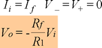
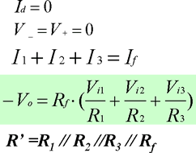
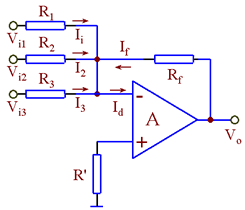
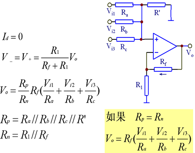
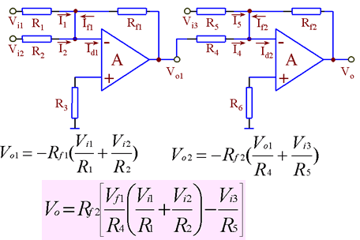
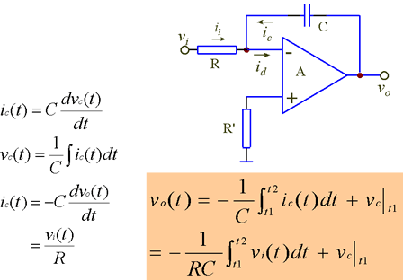

史上最全的运放典型应用电路及分析

+---------------------+-------------------------------------------------------------------------------------+---------------------+---------------------------------------------------------------------------------+------------------------------------------------------------------------------------------------------------------------------------+
| > 电路 名称         |                                                                                     | 典型电路            | 分析方法                                                                        | 主要特征                                                                                                                           |
+=====================+=====================================================================================+=====================+=================================================================================+====================================================================================================================================+
| > 同 相 比 例 器    | > {width="1.1874759405074367in" height="1.1541666666666666in"} |                     | > *u*+   = *ui*                                                                 | *u* = (1 + *RF* )*u*                                                                                                               |
|                     |                                                                                     |                     |                                                                                 |                                                                                                                                    |
|                     |                                                                                     |                     | *R*1                                             | > *o R i*                                                                                                                          |
|                     |                                                                                     |                     |                                                                                 | >                                                                                                                                  |
|                     |                                                                                     |                     | *u*−  = *uo*                                                                    | > 1                                                                                                                                |
|                     |                                                                                     |                     |                                                                                 |                                                                                                                                    |
|                     |                                                                                     |                     | *R*1 + *RF*                                                                     | （电压串联负反馈）                                                                                                                 |
|                     |                                                                                     |                     |                                                                                 |                                                                                                                                    |
|                     |                                                                                     |                     | ∴   *u* = *R*1 *u*                                                              |                                                                                                                                    |
|                     |                                                                                     |                     |                                                                                 |                                                                                                                                    |
|                     |                                                                                     |                     | > *i R* + *R o*                                                                 |                                                                                                                                    |
|                     |                                                                                     |                     | >                                                                               |                                                                                                                                    |
|                     |                                                                                     |                     | > 1 *F*                                                                         |                                                                                                                                    |
+---------------------+-------------------------------------------------------------------------------------+---------------------+---------------------------------------------------------------------------------+------------------------------------------------------------------------------------------------------------------------------------+
| > 反 相 比 例 器    | > {width="1.5994061679790026in" height="1.1859372265966754in"} |                     | > *u*+  = 0                                                                     | *u* = − *RF u*                                                                                                                     |
|                     |                                                                                     |                     | >                                                                               |                                                                                                                                    |
|                     |                                                                                     |                     | > *u*−  = 0                                                                     | > *o R i*                                                                                                                          |
|                     |                                                                                     |                     | >                                                                               | >                                                                                                                                  |
|                     |                                                                                     |                     | > *ui* = − *uo R*1 *RF*                                                         | > 1                                                                                                                                |
|                     |                                                                                     |                     |                                                                                 |                                                                                                                                    |
|                     |                                                                                     |                     |                                                                                 | （电压并联负反馈）                                                                                                                 |
+---------------------+-------------------------------------------------------------------------------------+---------------------+---------------------------------------------------------------------------------+------------------------------------------------------------------------------------------------------------------------------------+
| > 反 相 加 法 运 算 | > {width="1.7421773840769903in" height="1.3333333333333333in"} |                     | > *u*+  = 0                                                                     | *u* = −*R* ( *ui*1 + *ui* 2 + *ui* 3 )                                                                                             |
|                     |                                                                                     |                     | >                                                                               |                                                                                                                                    |
|                     |                                                                                     |                     | > *u*−  = 0                                                                     | *o F R R R*                                                                                                                        |
|                     |                                                                                     |                     | >                                                                               |                                                                                                                                    |
|                     |                                                                                     |                     | > *ui* + *ui* 2 + *ui* 3 = − *uo R*1 *R*2 *R*3 *RF*                             | > 1 2 3                                                                                                                            |
+---------------------+-------------------------------------------------------------------------------------+---------------------+---------------------------------------------------------------------------------+------------------------------------------------------------------------------------------------------------------------------------+
| > 减 法 运 算 电 路 |                                                                                     |                     | > *u* = *R*3 *u*                                 | > *u* = (1 + *RF* ) *R*3 *u* − *RF u* |
|                     |                                                                                     |                     |                                                                                 | >                                                                                                                                  |
|                     |                                                                                     |                     | -   *R* + *R i* 2 2 3                                                           | > *o R R* + *R i* 2 *R i*1                                                                                                         |
|                     |                                                                                     |                     |                                                                                 | >                                                                                                                                  |
|                     |                                                                                     |                     | > *u* = 1 (*R u* + *R u* )                                                      | > 1 2 3 1                                                                                                                          |
|                     |                                                                                     |                     |                                                                                 | >                                                                                                                                  |
|                     |                                                                                     |                     | -   *R* + *R* 1 *o F i*1                                                        | > 若*R* = *R* = *R* =  *R*                                                                                                         |
|                     |                                                                                     |                     |                                                                                 | >                                                                                                                                  |
|                     |                                                                                     |                     | > 1 2                                                                           | > 1 2 3 *F*                                                                                                                        |
|                     |                                                                                     |                     | >                                                                               | >                                                                                                                                  |
|                     |                                                                                     |                     | > *u*+ = *u*−                                                                   | > *uo* = *ui* 2 − *ui*1                                                                                                            |
+---------------------+-------------------------------------------------------------------------------------+---------------------+---------------------------------------------------------------------------------+------------------------------------------------------------------------------------------------------------------------------------+
| > 积 分 运 算 电 路 |                                                                                     |                     | > *u*+   = *u*−   = 0                                                           | > 1                                                                                                                                |
|                     |                                                                                     |                     | >                                                                               | >                                                                                                                                  |
|                     |                                                                                     |                     | > *ui* = −*c duo* | > *uo* = − ∫ *ui dt RC*                                                                                                            |
|                     |                                                                                     |                     | >                                                                               |                                                                                                                                    |
|                     |                                                                                     |                     | > *R dt*                                                                        |                                                                                                                                    |
+---------------------+-------------------------------------------------------------------------------------+---------------------+---------------------------------------------------------------------------------+------------------------------------------------------------------------------------------------------------------------------------+
| > 微 分 运 算 电 路 | > {width="1.71376312335958in" height="1.328124453193351in"}    |                     | > *u*+  = *u*−  = 0                                                             | > *u* = −*RC dui o dt*                                                                              |
|                     |                                                                                     |                     | >                                                                               |                                                                                                                                    |
|                     |                                                                                     |                     | > *c dui* = − *uo dt R*                          |                                                                                                                                    |
+---------------------+-------------------------------------------------------------------------------------+---------------------+---------------------------------------------------------------------------------+------------------------------------------------------------------------------------------------------------------------------------+

+---------------------------+--------------------------------------------------------------------------------------+----------------------------------------------------------------+--------------------------------------------------------------------------------------+
| > 一 阶 低 通 滤 波 电 路 | > {width="1.7185553368328959in" height="1.3365616797900262in"}  | > *U*& = *R*1 *U*&                                             | > 1 + *R F*                                           |
|                           |                                                                                      |                                                                |                                                                                      |
|                           |                                                                                      | -   *R* + *R o*                                                | *U*& = *R*1 &                                         |
|                           |                                                                                      |                                                                |                                                                                      |
|                           |                                                                                      | > 1 *F*                                                        | > *o ω  U i*                                                                         |
|                           |                                                                                      |                                                                |                                                                                      |
|                           |                                                                                      | *U*& = *U*& 1                                                  | 1 + *j*                                                                              |
|                           |                                                                                      |                                                                |                                                                                      |
|                           |                                                                                      | > *i*                           | > *ω*                                                                                |
|                           |                                                                                      | >                                                              | >                                                                                    |
|                           |                                                                                      | > *R* +   1                     | > *o*                                                                                |
|                           |                                                                                      | >                                                              | >                                                                                    |
|                           |                                                                                      | > \+                                                           | > *ω   *=  1                                                                         |
|                           |                                                                                      | >                                                              | >                                                                                    |
|                           |                                                                                      | > *jωc*                                                        | > *o RC*                                                                             |
|                           |                                                                                      | >                                                              |                                                                                      |
|                           |                                                                                      | > *jωc*                                                        |                                                                                      |
|                           |                                                                                      | >                                                              |                                                                                      |
|                           |                                                                                      | > *U*& = *U*&                                                  |                                                                                      |
|                           |                                                                                      | >                                                              |                                                                                      |
|                           |                                                                                      | > \+ −                                                         |                                                                                      |
+===========================+======================================================================================+================================================================+======================================================================================+
| > 一 阶 高 通 滤 波 电 路 | > {width="1.7908333333333333in" height="1.5in"}                 | > *U*& = *R*1 *U*&                                             | > 1 + *R F*                                           |
|                           |                                                                                      |                                                                | >                                                                                    |
|                           |                                                                                      | -   *R* + *R o*                                                | > *U*& = *R*1 *U*&                                                                   |
|                           |                                                                                      |                                                                |                                                                                      |
|                           |                                                                                      | > 1 *F*                                                        | -   *i*                                                                              |
|                           |                                                                                      | >                                                              |                                                                                      |
|                           |                                                                                      | > *U*& = *RU*&                                                 | > 1 − *j ω*0           |
|                           |                                                                                      | >                                                              | >                                                                                    |
|                           |                                                                                      | > *i*                           | > *ω*                                                                                |
|                           |                                                                                      | >                                                              | >                                                                                    |
|                           |                                                                                      | > 1                                                            | > *ω   *=  1                                          |
|                           |                                                                                      | >                                                              |                                                                                      |
|                           |                                                                                      | > \+                                                           | -   *RC*                                                                             |
|                           |                                                                                      |                                                                |                                                                                      |
|                           |                                                                                      | *R* +                                                          |                                                                                      |
|                           |                                                                                      |                                                                |                                                                                      |
|                           |                                                                                      | > *jωc*                                                        |                                                                                      |
|                           |                                                                                      | >                                                              |                                                                                      |
|                           |                                                                                      | > *U*& = *U*&                                                  |                                                                                      |
|                           |                                                                                      | >                                                              |                                                                                      |
|                           |                                                                                      | > \+ −                                                         |                                                                                      |
+---------------------------+--------------------------------------------------------------------------------------+----------------------------------------------------------------+--------------------------------------------------------------------------------------+
| > 同 相 比 较 器          | > {width="1.562004593175853in" height="0.7864577865266842in"}   | > *ui\>uR* uo=+*U*o(sat) *ui=uR* 转折点 *ui\<uR uo= - Uo(s*at) | > {width="1.7122965879265093in" height="0.9898950131233596in"} |
+---------------------------+--------------------------------------------------------------------------------------+----------------------------------------------------------------+--------------------------------------------------------------------------------------+
| > 反 相 比 较 器          | > {width="1.5517202537182853in" height="0.8072911198600174in"} | > *ui\>uR uo=-Uo*(sat) *ui=uR* 转折点 *ui\<uR uo=+U*o(sat)     | > {width="1.7336231408573928in" height="1.03125in"}            |
+---------------------------+--------------------------------------------------------------------------------------+----------------------------------------------------------------+--------------------------------------------------------------------------------------+
| > 滞 回 比 较 器          | > {width="1.7502110673665792in" height="1.3958333333333333in"} | > *u*−  = *ui*                                                 | > {width="1.2574453193350832in" height="1.2239577865266842in"} |
+---------------------------+--------------------------------------------------------------------------------------+----------------------------------------------------------------+--------------------------------------------------------------------------------------+
|                           |                                                                                      | > *u* = *R*1 *u*                                               |                                                                                      |
+---------------------------+--------------------------------------------------------------------------------------+----------------------------------------------------------------+--------------------------------------------------------------------------------------+
|                           |                                                                                      | -   *R* + *R o*                                                |                                                                                      |
+---------------------------+--------------------------------------------------------------------------------------+----------------------------------------------------------------+--------------------------------------------------------------------------------------+
|                           |                                                                                      | > 1 2                                                          |                                                                                      |
+---------------------------+--------------------------------------------------------------------------------------+----------------------------------------------------------------+--------------------------------------------------------------------------------------+
| > 矩 形 波 发 生 器       | > {width="1.7721806649168854in" height="1.3541666666666667in"} | *u* = *R*1 *u*                                                 | > *T* = 2*RC* ln(1 + 2*R*2 )                                                         |
|                           |                                                                                      |                                                                |                                                                                      |
|                           |                                                                                      | -   *R* + *R o*                                                |                                                                                      |
|                           |                                                                                      |                                                                |                                                                                      |
|                           |                                                                                      | > 1 2                                                          |                                                                                      |
+---------------------------+--------------------------------------------------------------------------------------+----------------------------------------------------------------+--------------------------------------------------------------------------------------+
|                           |                                                                                      |                                                                | *R*1                                                                                 |
+---------------------------+--------------------------------------------------------------------------------------+----------------------------------------------------------------+--------------------------------------------------------------------------------------+
|                           |                                                                                      | > *u*−  = *uC*                                                 |                                                                                      |
+---------------------------+--------------------------------------------------------------------------------------+----------------------------------------------------------------+--------------------------------------------------------------------------------------+

+---------------------+-------------------------------------------------------------------------------------+------------------------------------------------------------------------------------------+----------------------+
| > *RC*              | > {width="1.9245417760279966in" height="1.578124453193351in"} | *R*                                                                                      | > *f* = 1            |
| >                   |                                                                                     |                                                                                          | >                    |
| > 正 弦 波 发 生 器 |                                                                                     | > *A* = 1+   *F*                                          | > *o* 2*π RC*        |
|                     |                                                                                     |                                                                                          |                      |
|                     |                                                                                     | 放大电路: *R*1                                                                           |                      |
|                     |                                                                                     |                                                                                          |                      |
|                     |                                                                                     | > 选频网络:                                                                              |                      |
|                     |                                                                                     | >                                                                                        |                      |
|                     |                                                                                     | > *F* = 1 *ω* 1 3 0 = *RC* |                      |
+=====================+=====================================================================================+==========================================================================================+======================+
+---------------------+-------------------------------------------------------------------------------------+------------------------------------------------------------------------------------------+----------------------+
